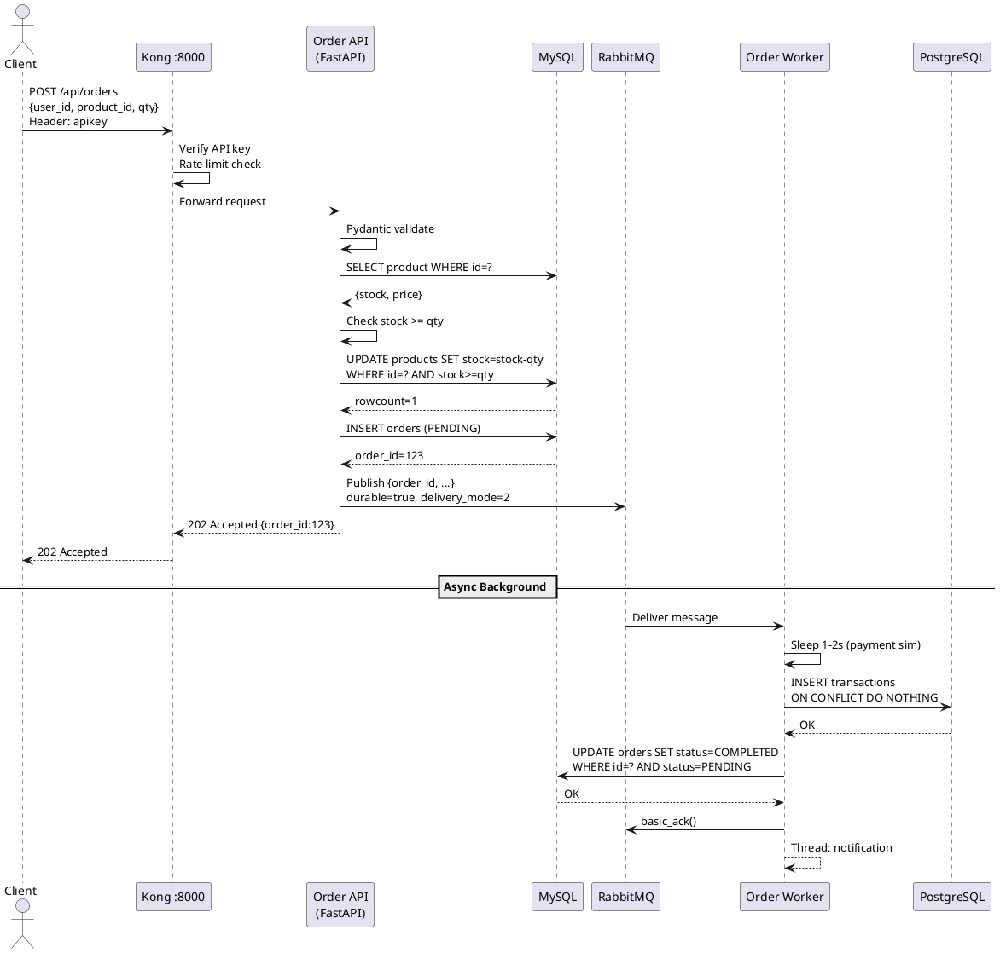

# 📋 HƯỚNG DẪN HỌC – Core System Architect
> **Huy, Ho Duong Quoc** | CS_466_E – Nhóm 7

---

## 🗺️ LUỒNG CHẠY TỔNG QUAN

```
Client (Postman / Browser)
    │  POST /api/orders  {user_id, product_id, quantity}
    ▼
Kong Gateway :8000   ← Xác thực API key, rate limit 10 req/phút
    │
    ▼
Order API (FastAPI :5001)
    │  1. Validate request bằng Pydantic
    │  2. SELECT product → kiểm tra stock
    │  3. UPDATE stock ATOMIC (WHERE stock >= qty)
    │  4. INSERT order status=PENDING
    │  5. COMMIT → trả 202 ngay
    │  6. Publish JSON vào RabbitMQ
    ▼
RabbitMQ – order_queue  ← durable, persistent
    │
    ▼
Order Worker (Consumer)
    │  1. Nhận message
    │  2. Giả lập thanh toán 1-2s
    │  3. INSERT PostgreSQL (transactions)
    │  4. UPDATE MySQL PENDING → COMPLETED
    │  5. ACK message
    │  6. Fire-and-forget notification (daemon thread)
    ▼
MySQL: orders.status = COMPLETED
PostgreSQL: transactions (bản ghi tài chính)
```

---

## 📁 FILE CẦN HỌC (theo thứ tự)

| # | File | Vai trò |
|---|------|---------|
| 1 | `services/order_api/main.py` | FastAPI nhận đơn + atomic stock |
| 2 | `services/order_worker/worker.py` | Consumer + retry + DLQ |
| 3 | `docker-compose.yml` | Orchestrate 9 service |
| 4 | `mysql/init_mysql.sql` | Schema MySQL (products, orders) |
| 5 | `postgres/init_postgres.sql` | Schema PostgreSQL (transactions) |
| 6 | `kong/kong.yml` | API Gateway config |
| 7 | `main.py` (root) | Entry point data pipeline |
| 8 | `src/data_cleaning.py` | Làm sạch CSV tồn kho |

---

## 📄 FILE 1: `services/order_api/main.py` – FastAPI Producer

### Khởi tạo App và Middleware

```python
app = FastAPI(title="NOAH Order API", version="1.0.0")

app.add_middleware(
    CORSMiddleware,
    allow_origins=["*"],
    allow_methods=["*"],
    allow_headers=["*"],
)
```

**Tại sao?**
- `FastAPI()` tạo app với Swagger UI tự động tại `/docs`
- `CORSMiddleware` cho phép browser từ domain khác gọi API
- Trong production nên thay `"*"` bằng domain cụ thể

---

### Pydantic Model – Validate Request Body

```python
class OrderRequest(BaseModel):
    user_id:    int
    product_id: int
    quantity:   int

    @field_validator("quantity")
    @classmethod
    def quantity_must_be_positive(cls, v):
        if v <= 0:
            raise ValueError("quantity phải > 0")
        return v

    @field_validator("user_id", "product_id")
    @classmethod
    def id_must_be_positive(cls, v):
        if v <= 0:
            raise ValueError("ID phải > 0")
        return v
```

**Tại sao dùng Pydantic?**
- FastAPI tự parse JSON → object Python, không cần `request.json.get(...)`
- `@field_validator` chạy TRƯỚC khi handler nhận dữ liệu
- Nếu validator raise ValueError → FastAPI trả 422 tự động
- Code sạch, type-safe, tự sinh Swagger docs

**Ví dụ input lỗi:**
```json
{"user_id": -1, "product_id": 5, "quantity": 0}
→ 422 Unprocessable Entity: "quantity phải > 0"
```

---

### Retry MySQL Connection

```python
def get_mysql_connection(max_retries: int = 5, delay: int = 5):
    last_err = None
    for attempt in range(1, max_retries + 1):
        try:
            conn = mysql.connector.connect(
                host=MYSQL_HOST, port=MYSQL_PORT,
                database=MYSQL_DB, user=MYSQL_USER,
                password=MYSQL_PASSWORD, connection_timeout=10
            )
            return conn
        except MySQLError as e:
            last_err = e
            log.warning(f"MySQL retry {attempt}/{max_retries}: {e}")
            if attempt < max_retries:
                time.sleep(delay)
    raise last_err
```

**Tại sao cần retry?**
- Docker Compose khởi động nhiều service song song
- MySQL cần 20-30s để khởi tạo xong DB
- Nếu API connect ngay → `Connection refused` → crash
- Retry 5 lần, mỗi lần chờ 5s → tổng chờ được 25s

---

### Atomic Stock Handling – Chống Overselling

```python
# Bước 1: Lấy thông tin sản phẩm
cursor.execute("SELECT id, name, price, stock FROM products WHERE id = %s", (order.product_id,))
product = cursor.fetchone()

if not product:
    raise HTTPException(status_code=404, detail="Sản phẩm không tồn tại")

# Bước 2: Kiểm tra sơ bộ (không đủ để chống race condition)
if product["stock"] < order.quantity:
    raise HTTPException(status_code=400, detail="Không đủ tồn kho")

# Bước 3: ATOMIC UPDATE – đây là "khóa thật"
cursor.execute(
    "UPDATE products SET stock = stock - %s WHERE id = %s AND stock >= %s",
    (order.quantity, order.product_id, order.quantity)
)

# rowcount=0 → có thread khác mua trước, stock không đủ nữa
if cursor.rowcount == 0:
    conn.rollback()
    raise HTTPException(status_code=400, detail="Tồn kho đã thay đổi. Vui lòng thử lại.")
```

**Vấn đề Race Condition – Tại sao cần atomic?**

```
Không có atomic (NGUY HIỂM):
Thread A đọc stock=5, qty=3 → đủ hàng ✓
Thread B đọc stock=5, qty=4 → đủ hàng ✓  (cùng lúc)
Thread A: UPDATE stock = 5-3 = 2  ✅
Thread B: UPDATE stock = 2-4 = -2 💥 OVERSELLING!

Có atomic WHERE stock >= qty:
Thread A: UPDATE WHERE stock(5)>=3 → rowcount=1 ✅  stock=2
Thread B: UPDATE WHERE stock(2)>=4 → rowcount=0 ❌ → raise 400
```

**Cơ chế:** MySQL dùng row-level lock khi UPDATE. Chỉ 1 thread thắng. Đây là **Optimistic Locking đơn giản nhất** – không cần `SELECT FOR UPDATE`.

---

### Transaction + Publish Queue

```python
# INSERT đơn hàng và COMMIT trước
total_price = product["price"] * order.quantity
cursor.execute(
    "INSERT INTO orders (user_id, product_id, quantity, total_price, status, created_at) VALUES (%s,%s,%s,%s,'PENDING',NOW())",
    (order.user_id, order.product_id, order.quantity, total_price)
)
conn.commit()           # ← COMMIT ngay, không chờ worker
order_id = cursor.lastrowid

# Publish vào RabbitMQ SAU khi đã commit
publish_to_queue(message)

# Trả 202 Accepted ngay cho client
return {"message": "Order received", "order_id": order_id, "status": "PENDING"}
```

**Tại sao commit trước rồi mới publish?**

| Thứ tự | Nếu publish fail sau commit | Nếu commit fail sau publish |
|--------|----------------------------|----------------------------|
| Kết quả | Đơn ở PENDING, có thể retry/recover | Worker xử lý đơn không tồn tại → crash |
| **→** | **An toàn hơn** | **Nguy hiểm** |

**Tại sao trả 202 (Accepted) không phải 200 (OK)?**
- 202 = "Tôi đã nhận yêu cầu, đang xử lý nền"
- Worker xử lý bất đồng bộ → client không cần chờ

---

### Publish RabbitMQ với Retry

```python
def publish_to_queue(message: dict, max_retries: int = 3):
    for attempt in range(1, max_retries + 1):
        try:
            credentials = pika.PlainCredentials(RABBITMQ_USER, RABBITMQ_PASS)
            params = pika.ConnectionParameters(
                host=RABBITMQ_HOST,
                credentials=credentials,
                heartbeat=30,          # ← Giữ kết nối sống
                connection_attempts=3
            )
            connection = pika.BlockingConnection(params)
            channel = connection.channel()

            channel.queue_declare(queue=QUEUE_NAME, durable=True)  # ← Queue bền vững
            channel.basic_publish(
                exchange='',
                routing_key=QUEUE_NAME,
                body=json.dumps(message, ensure_ascii=False),
                properties=pika.BasicProperties(delivery_mode=2)  # ← Message persistent
            )
            connection.close()
            return True
        except Exception as e:
            log.warning(f"RabbitMQ retry {attempt}/{max_retries}: {e}")
            if attempt < max_retries:
                time.sleep(3)
    raise last_err
```

**Giải thích từng tham số:**
- `durable=True` → Queue tồn tại sau khi RabbitMQ restart
- `delivery_mode=2` → Message được ghi xuống disk, không mất khi RabbitMQ crash
- `heartbeat=30` → Ping mỗi 30s để giữ TCP connection

---

## 📄 FILE 2: `services/order_worker/worker.py` – RabbitMQ Consumer

### Setup Consumer Loop

```python
def main():
    while True:          # ← Vòng lặp vô tận để tự reconnect
        try:
            connection = retry_rabbitmq()
            channel    = connection.channel()

            channel.queue_declare(queue=QUEUE_NAME, durable=True)
            channel.queue_declare(queue=DLQ_NAME, durable=True)  # Khai báo DLQ

            channel.basic_qos(prefetch_count=1)  # ← Chỉ lấy 1 msg mỗi lần

            channel.basic_consume(
                queue=QUEUE_NAME,
                on_message_callback=process_order,
                auto_ack=False   # ← Manual ACK quan trọng!
            )
            channel.start_consuming()   # ← Block, chờ message

        except KeyboardInterrupt:
            break
        except Exception as e:
            log.error(f"Mất kết nối: {e}. Reconnect sau 10s...")
            time.sleep(10)
```

**Giải thích:**
- `while True` → Nếu mất kết nối RabbitMQ → tự reconnect, không crash
- `prefetch_count=1` → Worker xử lý xong message này mới lấy message tiếp (backpressure – tránh bị overwhelm)
- `auto_ack=False` → Worker phải gọi `basic_ack()` thủ công. Nếu worker crash trước khi ACK → RabbitMQ giữ message lại, không mất

---

### Exponential Backoff Retry

```python
def db_operation_with_retry(operation_name, operation_func, max_retries=3, base_delay=2):
    last_err = None
    for attempt in range(1, max_retries + 1):
        try:
            return operation_func()
        except Exception as e:
            last_err = e
            delay = base_delay * (2 ** (attempt - 1))
            # attempt=1 → delay = 2 * 2^0 = 2s
            # attempt=2 → delay = 2 * 2^1 = 4s
            # attempt=3 → delay = 2 * 2^2 = 8s
            log.warning(f"{operation_name} thất bại lần {attempt}. Retry sau {delay}s...")
            if attempt < max_retries:
                time.sleep(delay)
    raise last_err
```

**Tại sao Exponential Backoff?**
- Retry ngay lập tức khi DB quá tải → càng retry càng nghẽn
- Tăng dần delay → cho DB thời gian recover
- Pattern chuẩn trong mọi hệ thống distributed (AWS, Google Cloud đều dùng)

**Cách dùng:**
```python
def postgres_insert():
    pg_conn = retry_postgres()
    pg_cursor = pg_conn.cursor()
    pg_cursor.execute("INSERT INTO transactions ... ON CONFLICT (order_id) DO NOTHING", (...))
    pg_conn.commit()
    pg_conn.close()

db_operation_with_retry("PostgreSQL INSERT", postgres_insert)
```

---

### ACK / NACK / DLQ – Xử Lý Lỗi

```python
MAX_RETRY_COUNT = 3
DLQ_NAME = "order_queue_dlq"

def process_order(ch, method, properties, body):
    try:
        # ... xử lý thành công ...
        ch.basic_ack(delivery_tag=method.delivery_tag)  # ✅ Báo RabbitMQ: xong

    except Exception as e:
        retry_count = get_retry_count(properties)  # Đọc header x-retry-count

        if retry_count >= MAX_RETRY_COUNT:
            # Quá số lần retry → chuyển sang DLQ
            ch.basic_ack(delivery_tag=method.delivery_tag)  # ACK message cũ
            publish_to_dlq(ch, body, properties, reason=str(e))
        else:
            # Requeue với counter tăng lên
            ch.basic_ack(delivery_tag=method.delivery_tag)
            new_headers = {"x-retry-count": retry_count + 1}
            ch.basic_publish(
                exchange='',
                routing_key=QUEUE_NAME,
                body=body,
                properties=pika.BasicProperties(delivery_mode=2, headers=new_headers)
            )
```

**Luồng Retry:**
```
Lỗi lần 1 → requeue với header x-retry-count: 1
Lỗi lần 2 → requeue với header x-retry-count: 2
Lỗi lần 3 → requeue với header x-retry-count: 3
Lỗi lần 4 → retry_count(3) >= MAX(3) → publish DLQ
```

---

### Idempotency – Xử Lý Message Trùng Lặp

```python
# PostgreSQL: ON CONFLICT DO NOTHING
pg_cursor.execute(
    """INSERT INTO transactions (order_id, user_id, amount, ...)
       VALUES (%s, %s, %s, ...)
       ON CONFLICT (order_id) DO NOTHING""",
    (order_id, ...)
)

# MySQL: chỉ update khi đang PENDING
mysql_cursor.execute(
    "UPDATE orders SET status='COMPLETED' WHERE id=%s AND status='PENDING'",
    (order_id,)
)
```

**Kịch bản cần idempotency:**
```
Worker: INSERT PostgreSQL OK
Worker: UPDATE MySQL OK
Worker: crash TRƯỚC khi ACK
→ RabbitMQ requeue message
→ Worker nhận lại message
→ INSERT lại: ON CONFLICT DO NOTHING → không tạo bản ghi trùng ✅
→ UPDATE lại: WHERE status='PENDING' → đã COMPLETED → 0 rows, không lỗi ✅
```

---

### Fire-and-Forget Notification

```python
# Gửi thông báo bằng thread riêng – không chặn worker
threading.Thread(
    target=send_async_notification,
    args=(user_id, order_id, total_price, process_time_str),
    daemon=True   # ← Tự chết khi main thread chết
).start()
```

**Tại sao dùng Thread?**
- `pika` dùng blocking IO, không tương thích với `asyncio`
- Thread riêng → notification chạy nền, worker tiếp tục xử lý message khác
- `daemon=True` → không làm worker treo khi shutdown

---

## 📄 FILE 3: `docker-compose.yml` – Orchestration

### Health Check + depends_on

```yaml
mysql:
  healthcheck:
    test: ["CMD", "mysqladmin", "ping", "-h", "localhost"]
    interval: 10s      # Kiểm tra mỗi 10s
    timeout: 5s        # Timeout mỗi lần check
    retries: 10        # Thử 10 lần
    start_period: 30s  # Chờ 30s trước khi bắt đầu check

order_api:
  depends_on:
    mysql:
      condition: service_healthy    # ← Chờ MySQL HEALTHY thật sự
    rabbitmq:
      condition: service_healthy
```

**Tại sao cần `service_healthy`?**
- `depends_on` mặc định chỉ chờ container START (vài giây)
- MySQL cần 20-30s để init DB xong
- Nếu Order API start ngay → `Connection refused` → crash ngay lập tức
- `service_healthy` → đảm bảo thứ tự đúng

---

### Networks – Service Discovery

```yaml
networks:
  noah-network:
    driver: bridge

services:
  order_api:
    environment:
      MYSQL_HOST: mysql          # ← Tên service = hostname
      RABBITMQ_HOST: rabbitmq    # ← Docker DNS tự resolve
```

**Tại sao service name = hostname?**
Docker tạo internal DNS. `mysql` → IP của container `noah_mysql`. Không cần hardcode IP.

---

### Volumes – Persistent Data

```yaml
volumes:
  mysql_data:
  postgres_data:

mysql:
  volumes:
    - mysql_data:/var/lib/mysql   # ← Data tồn tại sau restart
```

Không có volume → `docker-compose down` → mất toàn bộ data.

---

## 📄 FILE 4: `mysql/init_mysql.sql` – MySQL Schema

### Bảng products

```sql
CREATE TABLE IF NOT EXISTS products (
    id         INT PRIMARY KEY,
    name       VARCHAR(255) NOT NULL,
    price      DECIMAL(12, 0) NOT NULL DEFAULT 0,
    stock      INT NOT NULL DEFAULT 0,           -- ← Key: tồn kho
    updated_at TIMESTAMP DEFAULT CURRENT_TIMESTAMP ON UPDATE CURRENT_TIMESTAMP
) CHARACTER SET utf8mb4 COLLATE utf8mb4_unicode_ci;
```

- `stock INT` → cột bị trừ khi có đơn hàng (atomic UPDATE)
- `utf8mb4` → hỗ trợ Unicode đầy đủ (tiếng Việt, emoji)
- `ON UPDATE CURRENT_TIMESTAMP` → tự cập nhật thời gian khi có thay đổi

### Bảng orders

```sql
CREATE TABLE IF NOT EXISTS orders (
    id          INT AUTO_INCREMENT PRIMARY KEY,
    user_id     INT NOT NULL,
    product_id  INT NOT NULL,
    quantity    INT NOT NULL,
    total_price DECIMAL(12, 0) NOT NULL DEFAULT 0,
    status      VARCHAR(50) NOT NULL DEFAULT 'PENDING',   -- ← PENDING/COMPLETED/FAILED
    created_at  TIMESTAMP DEFAULT CURRENT_TIMESTAMP,
    FOREIGN KEY (product_id) REFERENCES products(id) ON DELETE RESTRICT
);
```

- `status` track vòng đời đơn hàng: PENDING → COMPLETED
- `FOREIGN KEY` đảm bảo product_id phải tồn tại trong products

---

## 📄 FILE 5: `postgres/init_postgres.sql` – PostgreSQL Schema

```sql
CREATE TABLE IF NOT EXISTS transactions (
    id           SERIAL PRIMARY KEY,
    order_id     INT NOT NULL UNIQUE,    -- ← UNIQUE: key cho idempotency
    user_id      INT NOT NULL,
    amount       BIGINT NOT NULL,
    product_id   INT NOT NULL,
    quantity     INT NOT NULL,
    processed_at TIMESTAMP DEFAULT CURRENT_TIMESTAMP,
    note         TEXT
);

CREATE INDEX idx_transactions_user_id    ON transactions(user_id);
CREATE INDEX idx_transactions_order_id   ON transactions(order_id);
CREATE INDEX idx_transactions_processed_at ON transactions(processed_at);
```

**Tại sao split MySQL và PostgreSQL?**

| MySQL (noah_store) | PostgreSQL (noah_finance) |
|--------------------|---------------------------|
| Operational data (đơn hàng, tồn kho) | Financial/analytical data |
| Optimize OLTP (nhiều write nhỏ) | Optimize OLAP (report, aggregate) |
| Nếu PostgreSQL down → vẫn nhận đơn | Eventual consistency OK |

**Tại sao `UNIQUE` trên order_id?**
→ Cho phép `ON CONFLICT (order_id) DO NOTHING` → idempotency

---

## 📄 FILE 6: `kong/kong.yml` – API Gateway

```yaml
consumers:
  - username: noah-dashboard
    keyauth_credentials:
      - key: noah-secret-key    # ← API key để authenticate

services:
  - name: order-api-service
    url: http://order_api:5001  # ← Forward đến service nội bộ
    routes:
      - paths: [/api/orders]
        methods: [POST, GET]
    plugins:
      - name: key-auth          # ← Bắt buộc có header apikey
        config:
          key_names: [apikey]
          hide_credentials: true  # ← Xóa header trước khi forward
      - name: rate-limiting
        config:
          minute: 10            # ← Tối đa 10 req/phút
          policy: local
      - name: cors              # ← Cho phép browser gọi API
```

**Tại sao dùng Kong?**
- Tập trung auth, rate-limit, logging tại 1 điểm
- Các service nội bộ không cần tự xử lý auth
- `hide_credentials: true` → API key không lộ đến backend

**Client gọi đúng cách:**
```bash
curl -X POST http://localhost:8000/api/orders \
  -H "apikey: noah-secret-key" \
  -H "Content-Type: application/json" \
  -d '{"user_id":1,"product_id":100,"quantity":2}'
```

---

## 📄 FILE 7: `main.py` (root) – Data Pipeline Entry Point

```python
import sys
from src.data_cleaning import clean_data
from src.import_to_db import import_data

if __name__ == "__main__":
    sys.stdout.reconfigure(encoding='utf-8')  # ← Fix lỗi tiếng Việt trên Windows
    clean_data()    # Bước 1: Làm sạch CSV
    import_data()   # Bước 2: Import vào MySQL
```

**Luồng:** `inventory.csv` → `clean_data()` → `clean_inventory.csv` → `import_data()` → MySQL

---

## 📄 FILE 8: `src/data_cleaning.py` – Làm Sạch Dữ Liệu

```python
def clean_data() -> dict:
    inventory = {}   # dict: {product_id: total_quantity}
    skipped   = 0

    with open(INPUT_FILE, mode='r', encoding='utf-8') as file:
        reader = csv.DictReader(file)

        for row in reader:
            try:
                product_id = int(row['product_id'].strip())
                quantity   = int(row['quantity'].strip())

                if product_id <= 0:
                    raise ValueError(f"product_id không hợp lệ: {product_id}")
                if quantity < 0:
                    raise ValueError(f"quantity âm: {quantity}")

                # Xử lý DUPLICATES: cộng dồn thay vì ghi đè
                inventory[product_id] = inventory.get(product_id, 0) + quantity

            except (ValueError, KeyError) as e:
                skipped += 1
                log.warning(f"Bỏ qua dòng #{total_rows}: {e}")
```

**Chiến lược xử lý DUPLICATES (đặc thù nhóm 7):**
- Nếu cùng product_id xuất hiện nhiều lần → cộng dồn quantity
- Không ghi đè → không mất dữ liệu tồn kho
- Dòng lỗi (quantity âm, ID không hợp lệ) → bỏ qua, log warning

---

## 🔄 SEQUENCE DIAGRAM (PlantUML – copy vào plantuml.com)



---

## ✅ CHECKLIST HOÀN THÀNH

- [ ] Đọc `order_api/main.py` – hiểu Pydantic, atomic UPDATE, 202 response
- [ ] Đọc `order_worker/worker.py` – hiểu ACK/NACK, retry, DLQ, idempotency
- [ ] Đọc `docker-compose.yml` – hiểu healthcheck, depends_on, networks
- [ ] Đọc 2 file SQL – hiểu schema, constraint, index
- [ ] Đọc `kong/kong.yml` – hiểu key-auth, rate-limit, routing
- [ ] Chạy `docker-compose up` → mở RabbitMQ UI (localhost:15672)
- [ ] Gửi POST qua Postman, xem log worker xử lý
- [ ] Vẽ Component Diagram (draw.io): 9 box – Client, Kong, API, Worker, MQ, MySQL, PG, Frontend, LegacyAdapter
- [ ] Vẽ Sequence Diagram (copy PlantUML trên)
- [ ] Viết Concurrency Doc: giải thích atomic UPDATE chống overselling
- [ ] Viết Fault-tolerance Doc: retry exponential backoff + DLQ flow
